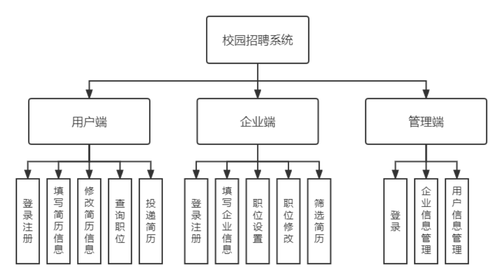

# 基于Django的校园招聘系统
**本科毕设**

本系统是以Django为核心技术开发的校园招聘平台。系统分为用户端、企业端和管理端三个主要部分。用户端面向求职高校毕业生，能够实现登录注册、填写简历、修改简历、查询职位、投递简历等功能；企业端面向企业，能够实现登录注册、填写企业信息、职位设置、职位修改、筛选简历等功能；管理端面向高校管理员，主要负责对企业和用户信息的审批和修改等操作。

### 说明
本项目基于Django和Bootstrap框架完成，安装步骤：

1、安装依赖文件requirements.txt

2、修改[settings.py](campusRecruitmentOS%2Fsettings.py)中的数据库

3、修改[settings.py](campusRecruitmentOS%2Fsettings.py)中的邮件配置（用于发送面试邀请）

### 系统功能示意图

### 页面展示
#### 1、首页

#### 2、招聘模块

#### 3、面试邀请 管理

